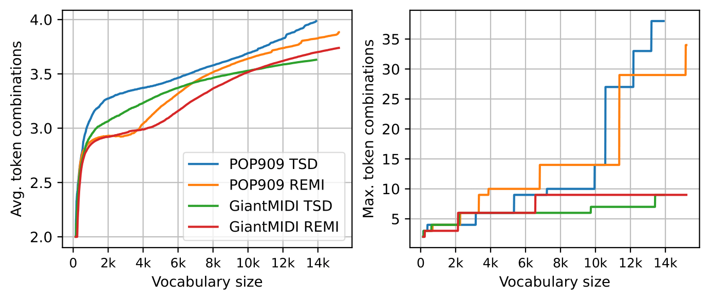
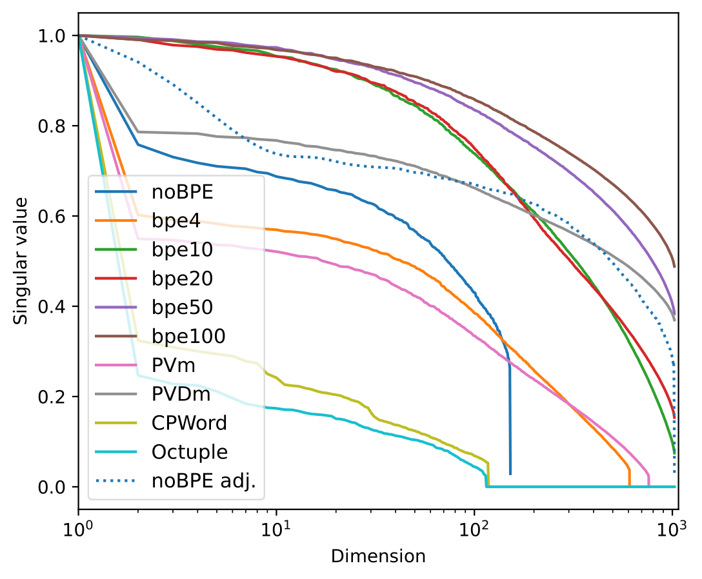
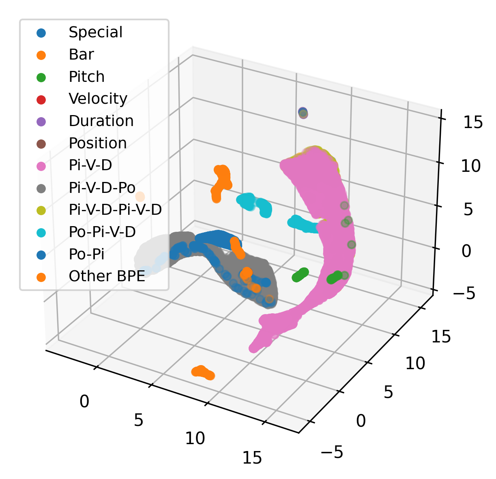
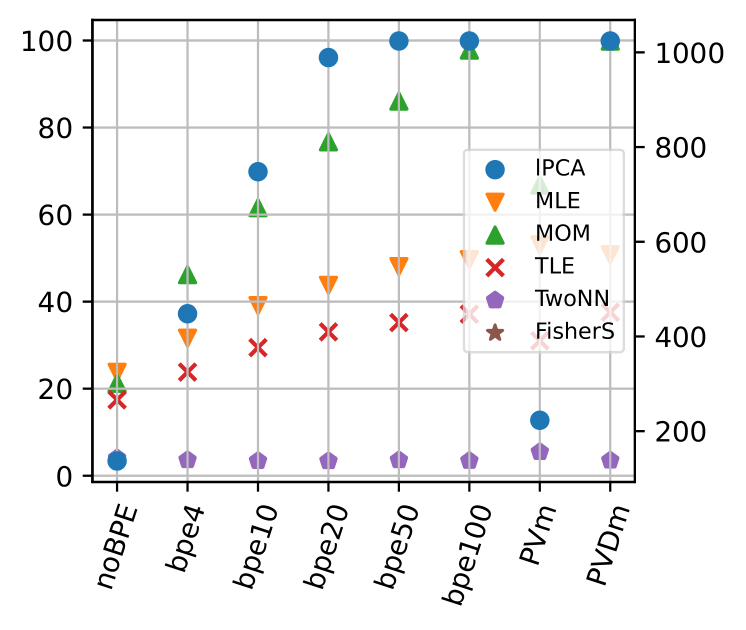

# Byte Pair Encoding for Symbolic Music

Code of the paper *Byte Pair Encoding for Symbolic Music*.

## Steps to reproduce

1. `pip install -r requirements` to install requirements
2. Download the [GiantMIDI](https://github.com/bytedance/GiantMIDI-Piano/blob/master/disclaimer.md) dataset and put it in `data/`
3. `sh scripts/download_pop909.sh` to download and preprocess the [POP909](https://github.com/music-x-lab/POP909-Dataset) dataset
4. `python scripts/tokenize_datasets.py` to tokenize data and learn BPE
5. `python exp_gen.py` to train generative models and generate results
6. `python exp_cla.py` to train classification models and test them

[Scripts](./scripts) can be run to get reproduce the analysis.

## BPE learning

By orders, figures above are for POP909 TSD, POP909 REMI, GiantMIDI TSD, GiantMIDI REMI

## Experiment results

We refer you to the tables of the paper.

## Learned embedding space

### Singular values

#### Generators : POP909 TSD, POP909 REMI, GiantMIDI TSD and GiantMIDI REMI

#### Classifiers : $\mathrm{Cla}\_{small}$ TSD, $\mathrm{Cla}\_{small}$ REMI, $\mathrm{Cla}\_{large}$ TSD and $\mathrm{Cla}\_{large}$ REMI

### UMAP Generators

Figures are by order for no BPE, BPEx4, BPEx10, BPEx20, BPEx50, BPEx100, PVm and PVDm.

#### POP909 TSD

#### POP909 REMI

#### GiantMIDI TSD

#### GiantMIDI REMI

### UMAP Classifiers

These figures are for $\mathrm{Cla}\_{small}$ and TSD. More figures can be found in [figures](./figures).

### Intrinsic dimension

#### Generators : POP909 TSD, POP909 REMI, GiantMIDI TSD and GiantMIDI REMI

#### Classifiers : $\mathrm{Cla}\_{small}$ TSD, $\mathrm{Cla}\_{small}$ REMI, $\mathrm{Cla}\_{large}$ TSD and $\mathrm{Cla}\_{large}$ REMI

